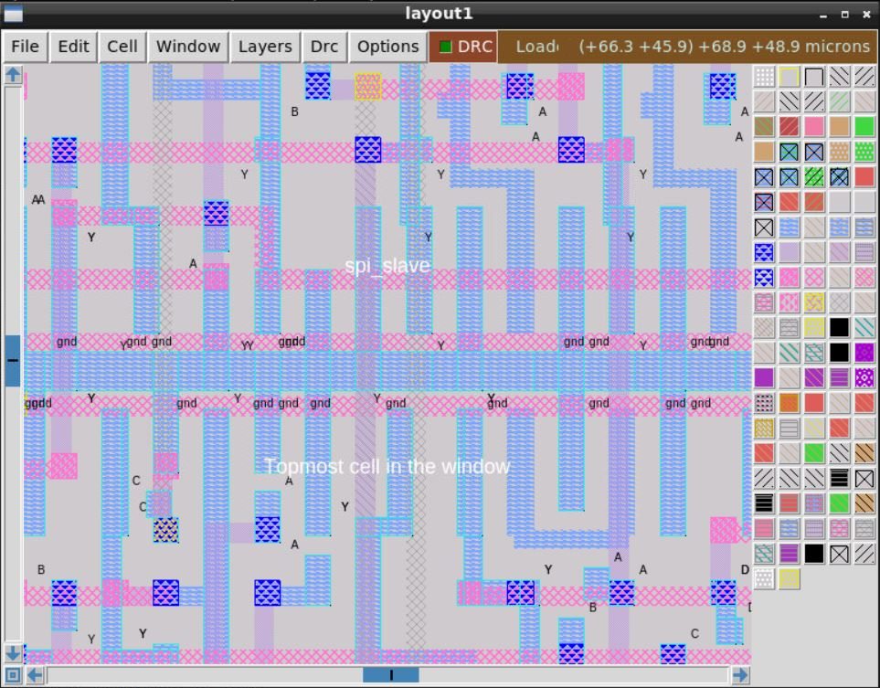
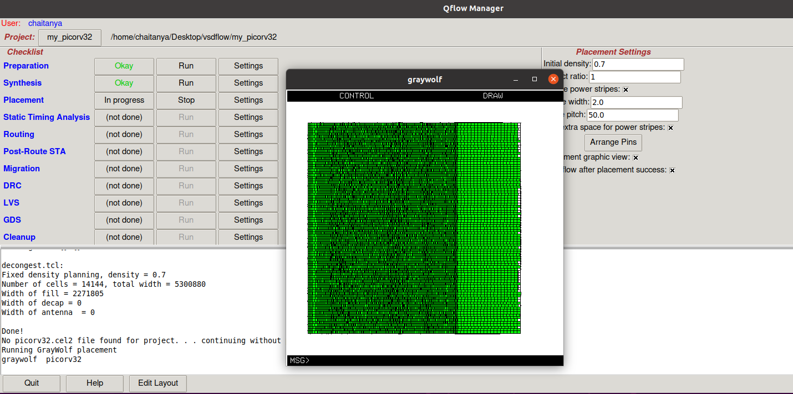
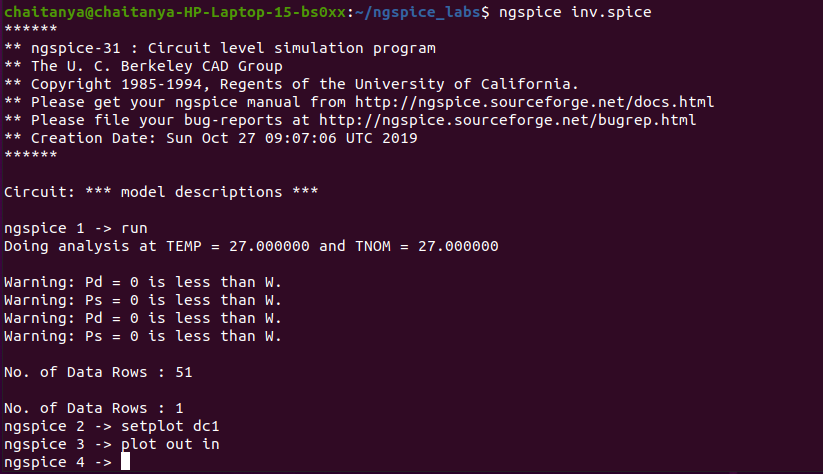

# PHYSICAL-DESIGN-Workshop
A very useful and informative workshop, where i have gained hands on experience on physical design tools like opentimer, ngspice , magic and sta. It hepled me to understand the flow of design from RTL file to GDSII on tsmc 180nm technology. From this workshop I learnt about SPEF "IEEE 1481-1999" standard,LEF, DEF, SDC files and their significance in the Design flow. Tools used are NGSPICE, MAGIC LAYOUT tool, YOSYS- logic synthesis, GRAYWOLF- placement, QROUTE- maze routing, OPENSTA- timing analysis and SPEF extractor.

## DAY 1 
    
 a)Description about Fundamentals of PCB and Chip Design.
    
 b)Fundamentals of Packages, PADS, Core and ICs.
    
 c)Introduction to RISC-V architecture.
    
 d)SoC brief taking an Raven chip model with internal explaination about SRAM, ADCs and other Analog IPs.
    
 e) Introduction on design flow and tools on which the design has to be implemented with a goal of processing RTL to GDSII. Tools like 
    
       YOSYS- Logic synthesis
       GREYWOLF- Placement 
       QROUTER- routing
       OPEN_TIMER- Static timing analysis
       MAGIC - layout viewer
       eSPICE - For SPICE simulations with schematically capturing the responses and functionality.
       Qflow - It is provided in order to ease the total design process for complete flow of RTL to GDSII 
       
 f) Invoked the flow using  below git clone for vsdflow : 
            
             git clone https://github.com/kunalg123/vsdflow.git
             
 
 
 g) VSDFLOW is scripted for SPI_SLAVE, using below commands spi_slave related files are generated which includes output files also.
        
             cd vsdflow
             ./vsdflow spi_slave_design_details.csv
             ls -ltr outdir_spi_slave/
             
  
        
 output files will be generated in below folder:
             
             cd outdir_spi_slave
         
 For viewing the layout of spi_slave below command is entered in terminal
             
             qflow display spi_slave
  
  
  
  
 h) In order to do synthesis for picorv32 few commands are entered in the terminal which results in the displaying 
    he number of gates, DFFs and other std_cells
    
  
  
  
  
## DAY2
        
 Definition of width and height of die, core which depends on standard cell dimensions. 
 Core internally consists of many standard cells placed properly with proper intensity, aspect ratio, utilisation factor
 and also location of pre placed cells.
        
 These pre placed cells with suitable decoupling capacitors with consideration of noise margin concept.
 
 The decoupling capacitors are of huge value which are placed between Vdd and Vss.
 
 Proper power planning is done in order to avoid IR drop and Ground Bounce.
 
        cd
        cd vsdflow
        mkdir my_picorv32
        cd my_picorv32
        mkdir source synthesis layout
        cp ~/vsdflow/verilog/picorv32.v source/.
        qflow gui &
        
        In GUI these below settings are made in order to do synthesis and placement:
        
        Technology = osu018
        Verilog source file : picorv32.v
        Verilog module : picorv32
        
   **GUI**
 
 
 
  **Synthesis Run**
  
 
   
   **PLACEMENT_RUN**
 
 
 ## DAY 3
 
   Mainly focused on the characterisation and design of basic cells using tools like NGSPICE and MAGIC LAYOUT.
   
   For this the static and dynamic behavioural responses of the CMOS inverter is studied with switching threshold,
   propagation delay and also slew rate.
      
   In order to do efficient layout Euler's method is used and then implemented on stick diagram(Euler's path). This method gives optimised
   metal connections and wirings.
   
   This stick diagram gives abstract layout using which the real layout is done on MAGIC tool using all the available templates like different metals
   n-diffuse, p-diffuse, n-subcontact, p-subcontact, polysilicon etc.
      
   Inverter characterisation is using the ngspice file using below commands. By resizing the PMOS the characteristics are observed
      
   Inverter Transient response:
   
  
  
  
 
 
